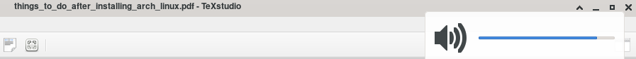

# Arch Linux PostInstall
<p align="center">
  
  
  
<br><br>
<a href="https://github.com/alikzmi/arch-postinstall/releases/">

Downlode PDF</a> Or Read here
<br>

## Things to do After Installing Arch Linux

### 1. Audio

First of all you need to install alsa-utils package.
```
$ sudo pacman -S alsa-utils
```
Then all you have to do is to type alsamixer in terminal and change the
value of `Master`.


You can also set Shortcuts (Hotkeys) with amixer.
```
amixer set Master +2
amixer set Master -2
amixer set Mute
```


Now you can easily change your `Audio Volume` by any key <br>
that you selected for these options.

**`I recommend to install ”pulseaudio” for better experience.`**

This is for xfce4 desktop environment :
```
# pacman -S pulseaudio xfce4-pulseaudio-plugin
$ pulseaudio −−start
```



### 2. Appearance

First of all install theme & icon.

```
$ sudo pacman -S adapta−gtk−theme papirus−icon−theme
```

Then change your window manager & appearance settings :

**Window Manager ¿ Style**

select Adapta−Nokto as your Style.

**Appearance ¿ Style**

select Adapta−Nokto−Eta as your Style.

**Appearance ¿ Icons**

select Papirus−Dark as your Icon.
```
$ reboot
```

### 3. Fonts

You can easily install fonts for Arch Linux. First of all you need to download the font files. Then use `mv` command or you file manager to store .ttf
files in a specific directory.
```
# pacman -S zip unzip noto−fonts−emoji
$ mkdir ∼/.fonts
$ cd /tmp
$ wget [File-URL]
$ unzip *zip
$ mv *ttf -t ∼/.fonts
$ fc-cache -fv
```

#### Notes :

I read an article about fonts which said it seems the `∼/.fonts` is deprecated. <br>
So i recommend you to replace `∼/.fonts` with `∼/.local/share/fonts` directory.

**`With fc-list command you can see the list of fonts installed on your home.`**

Finally make an XML file like this one :


fonts.conf

### 4. Printer

You can easily install your Printer driver. Just install cups & splix (for
samsung printers) and add your printer to cups.
```
# pacman -S cups splix
```
in your browser type `localhost:631` and follow these instructions to add
your printer to cups :


Cups Menu

Select `Administration`.


Administration Menu

Select `Add Printer` and login as **root**. <br>
Finally find your printer model and save changes.


Add Printer

## DONE!
